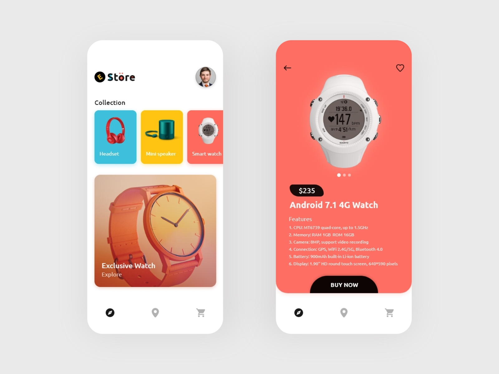

# E Store

Flutter UI Tutorial - E Store

### Purpose

This is an example of how to create a UI for an 'E Store'.

I did not create the design that credit is to a [dribbble](https://dribbble.com/) user. I can not find the source because I get a 404 error but if anybody finds it please let me know.

#### Disclaimer

There was an issue with the Hero animation. There is a bug I found on github that causes overflow. I hope this to be fixed going into the future. https://github.com/flutter/flutter/issues/27320

### Example UI

### Dribbble UI Design

